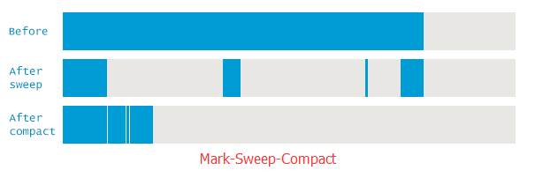
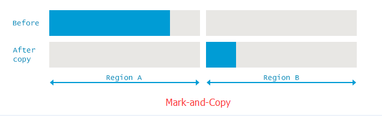

### Java虚拟机内存回收算法总结

> Java虚拟机内存回收作为虚拟机工作中最基础的部分，是作为Java学习者都必须要去了解的，简单来说垃圾回收理论上只需要两个步骤即可，找到那些需要回收的内存然后将其回收掉；本文主要是依据《深入理解Java虚拟机》一书的理解，围绕着哪些内存需要回收以及回收算法做了总结

#### 哪些内存需要回收？
判定哪些内存需要回收目前有两种算法可以选择
1. 引用计数器算法
2. 可达性分析算法

##### 引用计数器算法
该算法是通过对对象的引用做计数的统计进行标记的，这个算法比较好理解，就是当对象被引用时计数器就加1，当引用失效时就减1，当对象的应用数为0时，则可认为对象需要回收，这种方法虽然简单高效，但是Java虚拟机里并没有采用这种算法
主要原因是其无法很好的解决对象间相互引用，循环引用的问题

##### 可达性分析算法
可达性分析算法即图论中可达性判定，它需要事先定义好起点，然后通过判断起点到某个对象点是否可达来确定对象是否需要回收；这个起点在虚拟机垃圾回收时被定义为GC Roots，Java虚拟机定义了可以成为GC Roots的对象包括以下几种：
1.	虚拟机栈中引用的对象
2.	方法区中类静态属性引用的对象
3.	方法区中常量引用的对象
4.	本地方法栈中引用的对象

##### 关于引用的理解
无论是引用计数器还是可达性分析算法，都是判定一个对象是否被引用为标志的；但是在JVM中对象是否被引用并不是一个狭义的概念，为了处于对象的使用，内存的利用率和回收的效率考虑，Java对于引用做了进一步的细分，将引用分为了：强引用，软引用，虚引用，弱引用 四种引用类型；
不同的引用类型在JVM进行内存回收时，采用的策略是不同的；
1. 强引用 只要引用存在，垃圾回收器永远不会回收掉被引用的对象
2. 软引用 被软引用的对象，在系统将要发生内存溢出时，将会将这些对象列入被回收的范围，进行第二次回收
3. 虚引用 被虚引用的对象只能生存到下次垃圾收集发生之前，当垃圾回收发生时，无论当前内存是否够用，都会被回收掉
4. 弱引用 被弱引用的对象总是会被回收，其唯一的目的就是在被回收时收到一个系统通知

#### 回收算法
通过前面的可达性分析算法解决了哪些内存需要回收的问题，但是标记之后，关于回收的处理又有不同的算法可以选择，以下将对回收算法做一下介绍

##### 标记-清理（Mark-Sweep）
所谓标记-清理，即找到哪些需要回收的内存然后回收掉；这种算法比较基础，但是弊端也很明显，这种算法将会产生大量的内存碎片，导致后面的大对象需要分配内存时，无法正常分配，可能造成频繁的垃圾回收，进而产生效率问题

##### 标记-整理 (Mark-Sweep-Compact)
标记整理(压缩)算法，是在标记清理的基础上，将回收后仍然存活的对象移动到内存的一端，来解决标记清理导致的内存碎片问题；但是缺陷也很明显，由于整理过程涉及对象地址的变更，因此会增加GC停顿的时间; 

##### 标记-复制 (Mark-Copy)
标记-复制算法同样也是在为改进标记-清理算法的缺点，和标记-整理类似的是它们都涉及对象的移动重新定位，不同的是标记-复制是将对象移动到另一个区域；它的主要思路是：
将内存按容量划分为大小相等的两块（1:1），每次只使用其中一块，当这一块使用完后，将仍然存活的对象移动到另一块区域；虽然这样也能解决内存碎片化的问题，但是是通过牺牲内存空间为代价的；
在实际使用中由于大量的对象（超过98%）具有"朝生夕死"的特点，所以空间的分配并不是严格的1:1分配，而是将内存区域分为一个Eden空间两个Survivor空间比例为8:1:1；使用时只用 Eden和其中一个survivor，当回收时
将Eden和Survivor中仍然存活的对象，移动到另一个Survivor中；然后清理掉另外的两个空间；当然这样做是存在风险的；对象移动时有可能空间不够需要依赖其他内存进行分配担保

##### 分代收集
分代收集算法是当前商业虚拟机都采用的一种收集策略，这种算法更像是前面几种算法在不同场景下使用的组合；因为对象存活的周期不同，根据这些特点，将内存区域划分为几块，以Java为例，主要的内存回收区域为堆和方法区；堆被划分为 新生代和老年代；而方法区也被划分为老年代，
这样根据不同的区域对象的特点，选用不同的收集算法，可以有效的提高内存回收效率；在新生代由于每次垃圾回收都会有大量的对象死去，只有少量存活，只需要付出少量存活对象的复制就能达到目的，因此比较适合使用标记-复制算法；老年代由于对象存活率高，也没有额外的空间对齐做分配
担保，因此就必须采用标记-整理算法来进行回收

#### 总结
最近又对深入理解Java虚拟机这本书进行了阅读，有感于作者深厚的功力，每读一次都能得到不同的收获，我想最主要的是还是要能自己做一下总结，这样才能真正有所消化，然而等到自己去总结时，却发现并不那么容易，因为一去梳理总是能发现很多细节理解的不够，
在查阅了一些资料之后更是感到所知皆是皮毛，不知从何入手，如文中有表述不恰当之处，请大家一起学习

**参考文献**
1. 周志明. 深入理解Java虚拟机[M]. 北京:机械工业出版社, 2017.
2. <a href="https://plumbr.io/handbook/garbage-collection-algorithms" target="_blank">https://plumbr.io/handbook/garbage-collection-algorithms</a>
3. <a href="http://www.oracle.com/technetwork/java/javase/memorymanagement-whitepaper-150215.pdf" target="_blank">http://www.oracle.com/technetwork/java/javase/memorymanagement-whitepaper-150215.pdf</a>
4. <a href="http://www.oracle.com/technetwork/java/whitepaper-135217.html#garbage" target="_blank">http://www.oracle.com/technetwork/java/whitepaper-135217.html#garbage</a>

