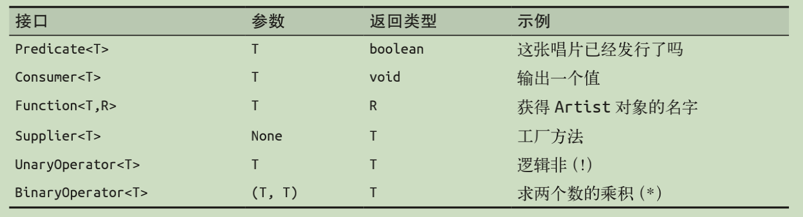

## 函数式编程和Lambda表达式

### 什么是函数式编程
   “函数式编程”是近几年出现的一种新的编程理念，每个人对它的理解都不尽相同；最开始接触这个概念的时候，我曾将其简单和面向过程的函数表达等同起来。最近在思考并尝试总结出一套“如何去编写扩展性良好，可读性强同时又兼具代码的简洁/整洁性的代码范式”，摸索了一条很好的实践原则即：“组合式分解+过程式表达”（关于这部分的实践以后有机会再做总结），前者可以发挥面向对象语言的优势通过对业务进行合理的抽象分解，基本可以保证程序具备良好的扩展性；而“过程式”表达，主要的思路还是想要尝试一种能够很好的进行业务逻辑表达的方式，在这个实践的过程中，我对“函数式编程”的理解又加深了一步，意外的发现“函数式编程”似乎天然具备这种优点，它带给我的感觉就是可以将业务逻辑的表达像自然语言一样“说”出来那样自然。关于函数式编程的定义和理解，可以参考阮一峰老师的科普文章：[函数式编程入门教程](http://www.ruanyifeng.com/blog/2017/02/fp-tutorial.html)

### 什么是Lambda表达式
Java8中引入的一项重要的新特性就是Lambda表达式，这个特性是Java8支持函数式编程的基础。结合“函数式编程”的基本概念，Lambda表达式可以概括为“是一种紧凑的传递行为的一种方式”。
一般来说Lambda表达式具备以下几个特征：

- Lambda表达式是一个匿名方法，可以将行为像数据一样传递
- Lambda表达式逻辑是引用值(final 修饰的变量)而不是变量
- Lambda表达式的常见结构：BinaryOperator<Integer> add = (x, y) → x + y
- Lambda表达式的类型是函数接口，这个函数接口是指具有单个抽象方法的接口

#### 匿名方法或匿名代码块
Lambda表达式是一个匿名方法或代码块，它可以将行为像数据一样传递
匿名类的表达方式：
```java
button.addActionListener(new ActionListener() {
	public void actionPerformed(ActionEvent event) { 
		System.out.println("button clicked"); 
	}
});
```

Lambda表达式的形式：
```java
button.addActionListener(event -> System.out.println("button clicked"));
```

#### 引用值而不是变量
在Lambda 表达式中，无法引用非终态变量(final类型的变量)。如果坚持用作非终态变量，编译器就会报错。这一点很好理解，例如我们在匿名类中引用外部变量，变量必须是final修饰的。
在匿名类中引用外部变量
```java
final String name = getUserName(); 
button.addActionListener(new ActionListener() {
	public void actionPerformed(ActionEvent event) { 
		System.out.println("hi " + name); 
	} 
});
```
在 Lambda表达式里的用法,虽然没有显式的将name变量修饰为final，但是当被Lambda表达式引用时，该变量已经被编译器认为是final类型的变量。
```java
String name = getUserName(); 
button.addActionListener(event -> System.out.println("hi " + name));
```
##### Lambda表达式的常见结构

```java
// 结构一 无参数形式
Runnable noArguments = () -> System.out.println("Hello World"); 
// 结构二 含有一个参数可省略 参数括号
ActionListener oneArgument = event -> System.out.println("button clicked"); 
// 结构三 有两个参数 不可省略括号，参数类型 依据泛型推断
BinaryOperator<Long> add = (x, y) -> x + y;
// 结构四 有两个参数，指定参数类型
BinaryOperator<Long> addExplicit = (Long x, Long y) -> x + y;
// 结构五 Lambda表达式的主体：可以是一个表达式 如 以上四种情形，也可以是一个代码块形式
Runnable multiStatement = () -> { 
	System.out.print("Hello"); 
	System.out.println(" World"); 
};	
```

#### 函数接口
在Java里所有的参数和方法都有固定的类型，而Lambda表达式的类型，被定义为函数接口，这种函数接口被限定为含有单个抽象方法的接口。

Java8中一些重要的函数接口


## 参考资料
- [Java8函数式编程](https://github.com/pzsoftchen/books/blob/master/Java%208%E5%87%BD%E6%95%B0%E5%BC%8F%E7%BC%96%E7%A8%8B.pdf)
