## 账号申请
- 申请成为Shopify Partner
- [申请地址](https://www.shopify.com/partners) 如下图按照提示填写注册信息
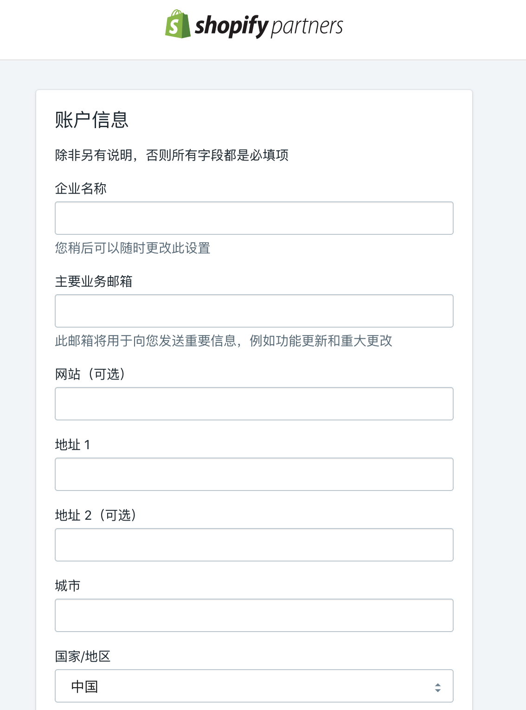


## 开发步骤

### 创建应用
如图：
- 创建应用
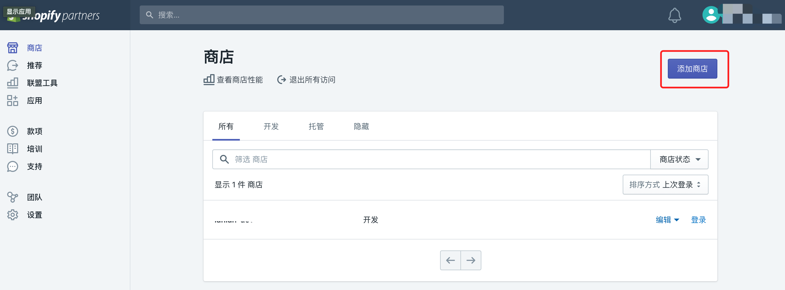

- 按要求填写应用信息，建议商店类型为```开发商店```
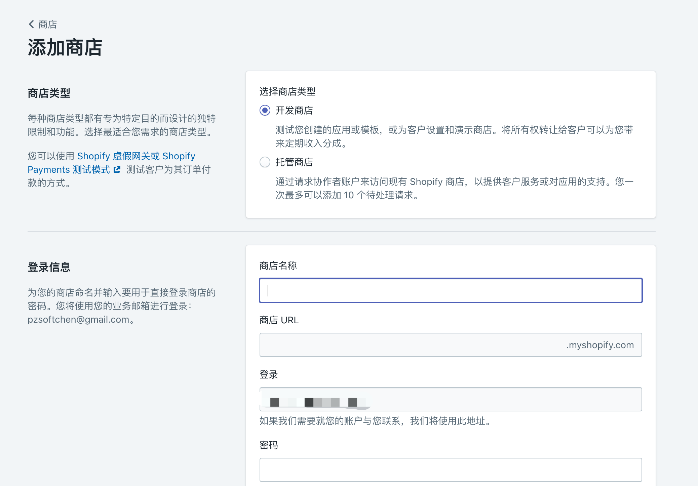

- 创建完之后可以在商店列表查看
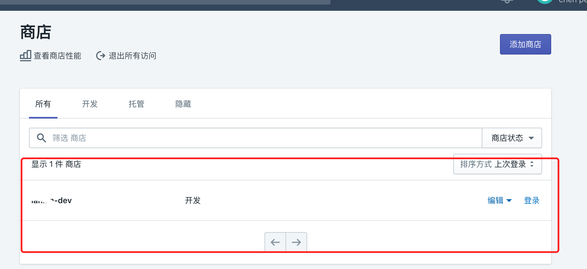

此时应用已创建完成

### 设置应用开发环境
- 登陆应用，如下图
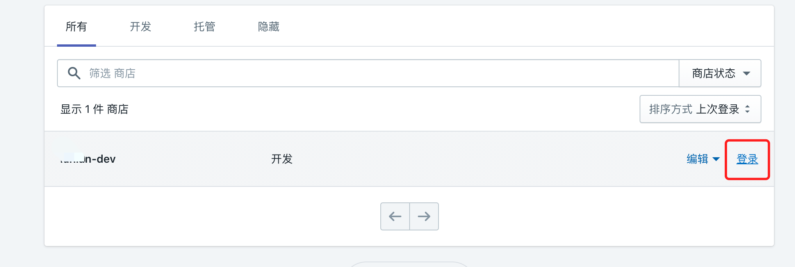

- 进入应用启用并创建私有应用
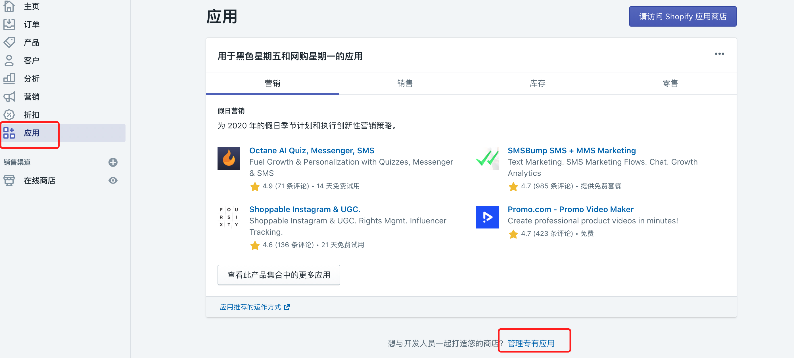

- 按照要求填写应用信息，并对主题模版授予读写权限
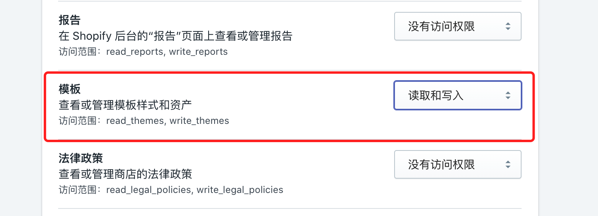

- 应用创建完成后，注意以下截图的信息
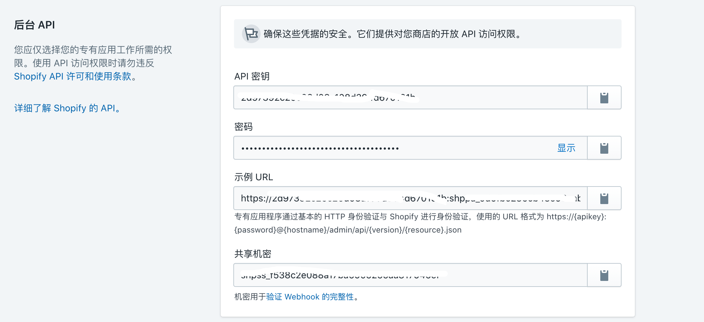

- 安装Theme Kit
按照 [工具地址](https://shopify.github.io/themekit/) 根据文档选择适合自己的安装方式即可

- 查看当前应用的主题信息
    ```
    ## password 即为你应用的密码
    theme get --list -p=[your-password] -s=[you-store.myshopify.com]
    ```
  如图，如果商定应用过多个主题，则会是一个列表：

  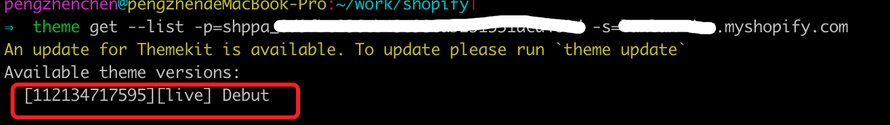
  ```[112134717595][live] Debut```

  前面的数字为主题的ID，live则表示，该主题为当前生效的主题。

- 获取主题模版
    ```
    theme get -p=[your-password] -s=[you-store.myshopify.com] -t=[your-theme-id]
    ```
    根据list命令查看到的主题列表，指定主题的ID即可将对应的主题下载下来
    如下图：
    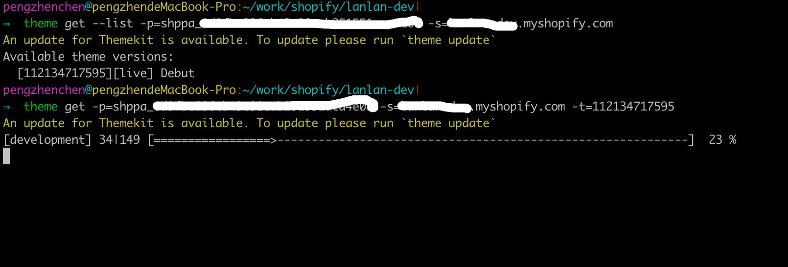

- 开发工具使用vscode打开下载的主题文件   
  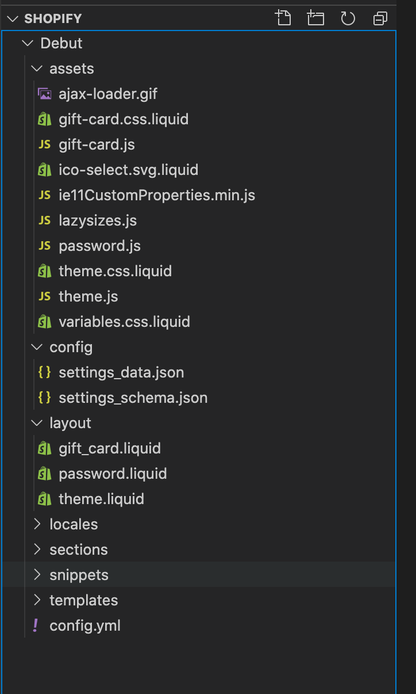
  

    
